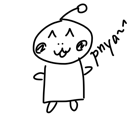

# geamzwa.github.io

Hello, I am a member of the Geamzwa Project. We are developing an artificial language "Geamzwa" starting in 2022.
The name "Geamz" comes from a character we created, "Tanaka Geamz Hitoshi".

The character itself has little to do with the Geamzwa grammar.

In developing the Geamzwa language, we have the following things in mind:
* Eliminate misunderstandings between speaker and listener.
* Be structural.
* Comical pronunciation.

This is still under development.

---

こんにちは。私たちは人工言語「ジェームズ語」を2022年から開発しています。
「ジェームズ」という名前は、私たちの作ったキャラクター「田中・ジェームズ・日都市」に由来します。

このキャラクター自体は、ジェームズ語の文法とはあまり関係がありません。

ジェームズ語を開発するにあたって、次の事柄を念頭に置いています。
* 話し手と聞き手のあいだに生まれる誤解をなくす
* 構造的である
* コミカルな発音をする

まだまだ開発途上ですが、よろしくお願いします。

---

Pnya. Wa-igea 'ac "geamzwa" putyoen ibl myee, 2022 ivro.
Le nani-"tanaka geamz hitoci" putyol myee oj honu bub kyommul "Geamz" 'ac nkorila.

Geamzwa 'aa thename ypii ogolniz hyneen-go.

Geamzwa putyol 'ik mwtl i xons-ca likken bubl.
* yitxma leit qyema re de-phitla kcahyon-watl
* moku
* nniyu 'e peppee

Kukuli yataa 'e putyola nmen, kokonilwo.
